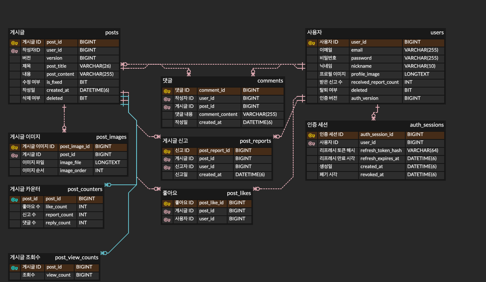

# Bamboo Board Backend

대나무숲 콘셉트의 익명 게시판 서비스 백엔드입니다. 회원 인증부터 게시글·댓글·좋아요·신고, 조회수 동시성 제어와 무중단 배포까지 구현했습니다.

## 소개

Bamboo Board는 사용자가 부담 없이 글을 작성하고 서로의 의견을 나눌 수 있는 익명 커뮤니티입니다.

백엔드에서는 트래픽이 집중되는 게시글 조회를 Redis에서 먼저 처리하고, 변경된 조회수를 MySQL에 주기적으로 반영합니다. 이 과정에서 원자적 증가, dirty set, 분산 락, AOF를 적용해 여러 서버가 동시에 실행되는 환경에서도 조회수 유실을 방지했습니다.

좋아요는 사용자·게시글 조합에 유니크 제약 조건을 적용합니다.

## 개발 인원 및 기간

- 개발 기간 : 2026-05-25 ~ 2024-08-09
- 개발 인원 : 프론트엔드/백엔드 1명 (본인)

## 사용 기술 및 툴

- Java 26
- Spring Boot 4
- Spring Web, Spring Security, Spring Validation
- Spring Data JPA
- MySQL 8, H2, Flyway
- Redis 7, Redisson
- JWT 인증
- Docker, Nginx
- GitHub Actions, AWS

## 주요 기능

- 회원가입, 로그인, 로그아웃, 회원정보 수정, 프로필 수정, 비밀번호 변경, 회원 탈퇴
- JWT 액세스 토큰과 리프레시 세션 기반 인증
- 게시글 작성, 수정, 삭제, 이미지 등록
- 게시글 목록, 상세 조회
- 댓글 작성, 수정, 삭제
- 좋아요 및 좋아요 취소
- 게시글 신고와 신고 누적에 따른 제한
- Redis 기반 고트래픽 조회수 처리
- MySQL 분리 조회수 테이블 반영
- Blue/Green 방식 백엔드 배포

## 폴더 구조

```text
src/main/java/kr/adapterz/springdatajpa
├── auth          # JWT와 인증 세션
├── config        # 보안, CORS, 조회수 설정
├── controller    # HTTP API 진입점
├── dto           # 요청·응답 객체
├── entity        # JPA 엔티티
├── exception     # 예외 정의
├── repository    # 데이터 접근 계층
├── service       # 비즈니스 로직과 조회수 반영 스케줄러
└── validation    # 입력값 검증

src/main/resources
├── db/migration  # Flyway 스키마와 변경 이력
└── application*.yaml

deploy
├── compose.yaml          # Redis, Blue/Green 백엔드, Nginx 구성
├── deploy-backend.sh     # 배포 색상 전환 스크립트
└── nginx                 # Blue/Green upstream 설정
```

## 실행 및 검증

```bash
docker run --name bamboo-redis-local -p 6379:6379 -d redis:7.4-alpine redis-server --appendonly yes --appendfsync everysec
./gradlew bootRun
./gradlew clean check --no-daemon
```

전체 검증에는 단위 테스트, MySQL·Redis Testcontainers 통합 테스트, JaCoCo 커버리지 검증이 포함됩니다.

## 데이터베이스 구조

최종 운영 구조는 `B3__current_schema.sql`에 V4 변경을 적용한 상태입니다. `post_counters`에는 좋아요·신고·댓글 수만 저장하고, 조회수는 `post_view_counts`로 분리했습니다. 기존 `post_counters.view_count` 컬럼은 `V4__remove_legacy_post_counter_view_count.sql`에서 제거합니다. `post_likes_seq`는 Hibernate가 좋아요 식별자를 생성할 때 사용하는 물리 테이블이지만, 좋아요 도메인 관계를 설명하는 ERD에서는 제외했습니다.

### 요구사항 분석
유저
- 이메일, 비밀번호, 닉네임, 프로필 이미지와 신고 누적 수를 관리합니다.
- 탈퇴 여부와 비밀번호 변경에 따른 인증 버전을 저장합니다.
- 한 유저는 여러 인증 세션을 가질 수 있습니다.

게시물
- 제목, 내용, 작성일시, 수정 여부, 고정 여부, 삭제 여부를 관리합니다.
- 작성자를 참조하고, 게시글 이미지·댓글·좋아요·신고와 관계를 맺습니다.
- 게시글 수정 충돌을 감지하기 위해 버전 값을 사용합니다.

댓글
- 내용과 작성일시를 저장하고, 작성자와 게시글을 참조합니다.

좋아요
- 좋아요를 누른 유저와 게시글을 참조합니다.
- 같은 유저가 같은 게시글에 중복으로 좋아요를 만들 수 없도록 유니크 제약 조건을 둡니다.

신고
- 신고한 유저와 신고 대상 게시글을 참조하고 생성 시각을 저장합니다.
- 같은 유저가 같은 게시글을 중복 신고할 수 없도록 유니크 제약 조건을 둡니다.

카운터
- 게시글 ID를 기본키이자 외래키로 사용하는 1:1 보조 테이블입니다.
- 좋아요 수, 신고 수, 댓글 수만 저장하며 조회수는 저장하지 않습니다.
- 좋아요·신고·댓글 변경 시 게시글과 별도 행을 갱신해 게시글 본문과 카운터의 경합을 줄입니다.

조회수
- `post_view_counts`가 MySQL의 조회수 기준값을 관리합니다.
- 게시글 조회 시 Redis에서 원자적으로 증가하고, 변경된 게시글을 dirty set으로 추적합니다.
- 스케줄러가 분산 락을 획득한 인스턴스에서 Redis 값을 MySQL에 반영하며, Redis AOF로 재시작 상황의 복구를 보완합니다.
- 목록 조회는 MySQL에 반영된 기준값을 사용하고, 상세 조회는 Redis의 최신값을 우선 사용합니다.

세션
- 로그인 시 리프레시 토큰 해시와 만료 시각을 `auth_sessions`에 저장합니다.
- 리프레시 토큰을 갱신할 때 토큰 해시를 교체하고, 로그아웃·폐기 시각을 기록합니다.
- 사용자와 세션은 1:N 관계이며 만료 시각과 폐기 여부로 활성 세션을 검증합니다.

게시글 이미지
- 게시글에 여러 이미지를 연결할 수 있습니다.
- 이미지 URL과 표시 순서를 저장하고, 게시글 삭제·수정 시 게시글과 함께 관리합니다.

### 모델링

ERD: 

## Front-end

- (https://github.com/100-hours-a-week/KTB4_Miles_Week12_Front)


## 트러블 슈팅

내용 작성 예정

## 프로젝트 후기

이번 프로젝트에서는 기능 구현에 그치지 않고, 실제 트래픽이 집중되는 상황에서 데이터가 어떻게 유실될 수 있는지 부하 테스트로 확인했습니다. 조회수와 카운터를 하나의 행에서 갱신하던 구조를 분리하고, Redis 원자적 증가와 주기적 MySQL 반영을 적용하면서 동시성 제어를 코드와 측정 결과로 함께 설명할 수 있게 되었습니다.

또한 Redis 장애와 재시작, MySQL 반영 실패, 여러 백엔드 인스턴스의 스케줄러 중복 실행까지 고려했습니다. 테스트 과정에서 발견한 문제를 기준으로 구조를 단계적으로 개선했다는 점이 가장 큰 학습이었습니다.

## 배포

GitHub Actions에서 검증과 컨테이너 이미지 빌드를 수행하고, AWS SSM으로 배포 명령을 전달합니다. 새 버전은 비활성 색상에 먼저 실행한 뒤 상태 확인이 성공하면 Nginx 연결을 전환하는 Blue/Green 방식으로 운영합니다.

배포 주소는 http://54.116.128.239/login입니다.
